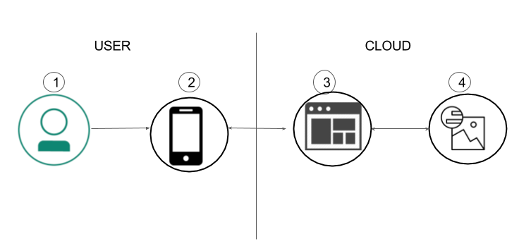
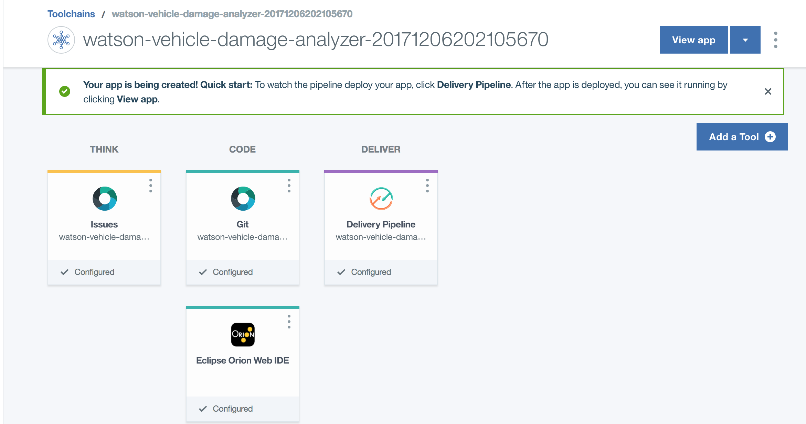
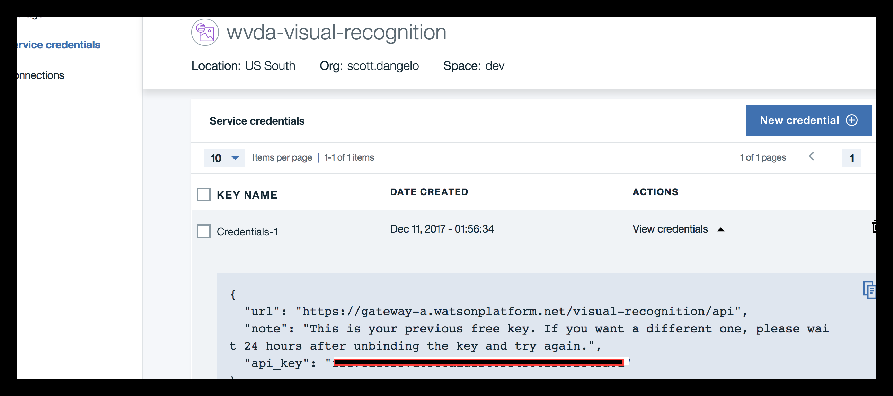
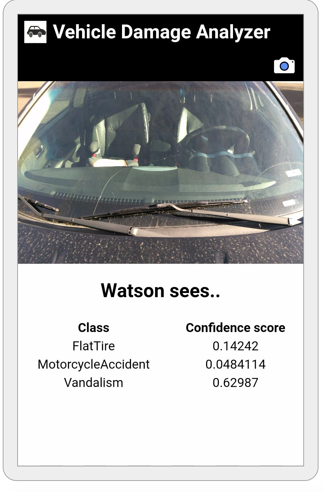

*阅读本文的其他语言版本：[English](README.md)。*
[](https://travis-ci.org/IBM/watson-vehicle-damage-analyzer)

# 创建一个自定义 Visual Recognition 分类器来分析车辆损坏情况

在本开发人员 Code Pattern 中，我们将使用 Apache Cordova、Node.js 和 Watson Visual Recognition 创建一个移动应用程序。该移动应用程序发送汽车和摩托车事故和问题的照片，以便通过一个服务器应用程序使用 Watson Visual Recognition 来分析这些照片。

服务器应用程序将使用汽车事故和其他事故的照片来训练 Watson Visual Recognition 识别各种类型的问题，比如故意破坏、挡风玻璃损坏、摩托车事故或爆胎。开发人员可以利用此应用程序为他们的用例创建自定义的 Visual Recognition 分类器。

读者完成本 Code Pattern 后，将会掌握如何：

* 创建一个能利用 Watson Visual Recognition 服务对图像进行分类的 Node.js 服务器。
* 让一个服务器在启动时初始化一个 Visual Recognition 自定义分类器。
* 在一个应用程序中创建一个 Visual Recognition 自定义分类器。
* 创建一个 Android 移动应用程序，它可以将照片发送给一个服务器应用程序，以便使用 Visual Recognition 对照片进行分类。



## 操作流程

1. 用户与移动应用程序交互并捕获一幅图像。
2. 将手机上的图像传递给在云中运行的服务器应用程序。
3. 服务器将图像发送给 Watson Visual Recognition 服务进行分析。
4. Visual Recognition 服务对图像进行分类，并将信息返回给服务器。

## 包含的组件

* [Watson Visual Recognition](https://www.ibm.com/watson/developercloud/visual-recognition.html)：Visual Recognition 理解图像的内容 - 为图像添加标签，查找人脸、大约年龄和性别，并在图库中查找类似图像。

## 特色技术

* 移动：互动参与体系越来越多地开始使用移动技术作为交付平台。
* [Node.js](https://nodejs.org/)：异步事件驱动的 JavaScript 运行时，旨在构建可扩展的应用程序。

# 步骤

本 Code Pattern 包含多个部分。应用服务器与 Watson Visual Recognition 服务进行通信。在本地构建移动应用程序并在 Android 手机上运行。您可以使用 IBM Cloud 来部署服务器应用程序，或者将应用程序部署到本地机器上。

## 将服务器应用程序部署到 IBM Cloud

[](https://bluemix.net/deploy?repository=https://github.com/IBM/watson-vehicle-damage-analyzer)

按上面的 ``Deploy to IBM Cloud`` 按钮，单击 ``Deploy``，然后跳到步骤 #5。

要监控部署情况，请在 Toolchains 中单击 `Delivery Pipeline`，并在部署应用程序时查看日志。



要查看为本 Code Pattern 创建和配置的应用程序和服务，可以使用 IBM Cloud 仪表板。此应用程序命名为 `watson-vehicle-damage-analyzer`（含有独特后缀）。可使用 `wvda-` 前缀来创建并轻松识别以下服务：
    * wvda-visual-recognition

> 记下 `watson-vehicle-damage-analyzer` URL 路径 - 在移动应用程序中稍后会用到。

## 本地部署服务器应用程序

执行步骤 1-9：

1. [克隆存储库](#1-clone-the-repo)
2. [创建 Watson Visual Recognition 服务](#2-create-the-watson-visual-recognition-service)
3. [将 Visual Recoginition API 密钥添加到 .env 文件](#3-add-visual-recoginition-api-key-to-env-file)
4. [安装依赖项并运行服务器](#4-install-dependencies-and-run-server)
5. [更新移动应用程序的配置值并安装构建依赖项](#5-update-config-values-for-the-mobile-app-and-install-build-dependencies)

6. 执行 6a 或 6b。

    6a.[安装依赖项，为 Android 构建移动应用程序](#6a-install-dependencies-to-build-the-mobile-application-for-android)

    6b.[在 Docker 容器中为 Android 运行移动应用程序构建](#6b-run-mobile-application-build-in-docker-container-for-android)

7. 使用 Cordova 部署到 Android

   7a.[添加 Android 平台和插件](#7a-add-android-platform-and-plug-ins)

   7b. [设置您的 Android 设备](#7b-setup-your-android-device)

   7c. [构建并运行该移动应用程序](#7c-build-and-run-the-mobile-app)

8. 使用 Cordova 部署到 iOS

   8a. [添加 iOS 平台和插件](#8a-add-ios-platform-and-plugins)

   8b. [设置 iOS 项目](#8b-setup-your-ios-project)

   8c. [将应用程序部署到 iOS 设备或仿真器](#8c-deploy-the-app-to-ios-device-or-emulator)

## 1. 克隆存储库

将 `watson-vehicle-damage-analyzer` 存储库克隆到本地。在终端中，运行以下命令：

```
$ git clone https://github.com/IBM/watson-vehicle-damage-analyzer.git
$ cd watson-vehicle-damage-analyzer
```

## 2. 创建 Watson Visual Recognition 服务

使用 IBM Cloud 或 Watson Studio（两者均可使用免费 `Lite` 套餐和 `Standard` 套餐）创建 Watson Visual Recognition 服务。确保此服务名为 `wvda-visual-recognition`。

* [**Watson Studio 上的 Watson Visual Recognition**](https://dataplatform.ibm.com/data/discovery/watson_vision_combined/details?target=watson&context=analytics)

或者

* [**IBM Cloud 上的 Watson Visual Recognition**](https://console.bluemix.net/catalog/services/visual-recognition)

### 为何提供两个选项？

传统上，[IBM Cloud](https://console.bluemix.net) 是面向应用程序开发者的主平台，而 [IBM Watson Studio](https://dataplatform.ibm.com/)（原名为 Data Science Experience）面向的则是数据科学家。2018 年初，新产品 [Watson Studio 正式推出](https://medium.com/ibm-watson/introducing-ibm-watson-studio-e93638f0bb47)。Watson Studio 为数据科学家和应用程序开发者提供了一套工具，让他们能够通过协作连接到数据，充分发掘此数据，并利用它来规模化构建、训练和部署模型。

为帮助您确定要使用的平台，请尝试回答以下问题：

* 我是否正在使用多个数据集？使用 Watson Studio
* 我是否正在为 Watson Visual Recognition 创建自定义分类器？使用 Watson Studio
* 我是否正在使用 Watson Visual Recognition 内置分类器？使用 IBM Cloud

千头万绪、不知所措？毋庸担心。您在 IBM Cloud 或 Watson Studio 中创建的任何资源均可相互混用。

## 3. 将 Visual Recoginition API 密钥添加到 .env 文件

要使用 Visual Recognition 服务，您将需要使用 API 密钥。

要在 Watson Studio 中检索密钥，请转至以下选项卡：


在 IBM Cloud 中将如下所示：



将 ``watson-vehicle-damage-analyzer/server/env.example`` 文件重命名为 ``watson-vehicle-damage-analyzer/server/.env``，并添加 API 密钥：

```
# Watson Visual Recognition
VISUAL_RECOGNITION_API_KEY=<add_api_key>
```

## 4. 安装依赖项并运行服务器

#### 如果您使用了 Deploy to IBM Cloud 按钮……

如果您使用了 ``Deploy to IBM Cloud``，则会自动进行设置。

#### 如果您决定在本地运行该应用程序……

* 安装 [Node.js and npm](https://nodejs.org/en/download/)（`npm` V4.5.0 或更高版本）

* 安装应用程序依赖项并启动应用程序：

```
$ npm install
$ npm start
```

#### 从浏览器测试该应用程序

如果您无法或不想构建移动应用程序，可以在浏览器中访问服务器并测试该应用程序。

* 对于本地运行的服务器，请打开浏览器选项卡并转至 `localhost:<port>`。
* 对于在 IBM Cloud 上运行的服务器，请打开浏览器选项卡并指向您的服务器的 URL `<IBM_Cloud_server_URL:port>`

默认端口为 `3000`

然后，您可以上传一张本地照片，比如来自此存储库的 `test/data/` 中的一张照片

## 5. 更新移动应用程序的配置值并安装构建依赖项

编辑 `mobile/www/config.json` 并使用以前获取的值来更新设置。

```javascript
"SERVER_URL": "put_server_url_here"
```

对于本 Code Pattern，您需要根据这些依赖项各自的文档来安装必备工具：

* [Cordova](https://cordova.apache.org/docs/en/latest/guide/platforms/android/index.html)
* [Gradle](https://gradle.org/install/)

## 6a.安装依赖项，为 Android 构建移动应用程序

构建移动应用程序需要一些依赖项，您需要自行手动安装这些依赖项。如果您运行 [Docker](https://docs.docker.com/engine/installation/)，可以通过跳到[在 Docker 容器中为 Android 运行移动应用程序构建](#6b-run-mobile-application-build-in-docker-container-for-android)，在容器中构建该移动应用程序

### 使用手动安装的依赖项

对于手动构建 Android 应用程序，您需要根据这些依赖项各自的文档来安装这些必备工具：

* [Java 开发工具包 (JDK)](http://www.oracle.com/technetwork/java/javase/downloads/jdk8-downloads-2133151.html)
* [Android Studio](https://developer.android.com/studio/)，其中包含 Android 工具并允许您访问 Android SDK

您需要安装适合您的移动设备的特定 SDK。从 `Android Studio`，下载并安装期望的 SDK API Level。我们使用 Android API Level 23，因为截至 2018 年 1 月，大部分手机都支持它。为此：

* 启动 `Android Studio` 并接受所有默认值。
* 单击工具栏中的 `SDK Manager` 图标。
* 导航到 `Appearance & Behavior` -> `System Settings` -> `Android SDK`
* 选择 Android 6.0 (Marshmallow) (API Level 23)。
* 单击 apply 进行下载并安装。

> ``mobile/config.xml`` 被配置为针对 Android API Level 23 进行构建。如果您希望针对不同的 API 进行构建，请调整此设置：
```
<preference name="android-targetSdkVersion" value="23" />
```

完成所有需要的安装和设置后，您需要针对您的平台来恰当设置以下环境变量：

* `JAVA_HOME`
* `ANDROID_HOME`
* `ANDROID_SDK_HOME`

#### 如何确定环境变量的合适值：

打开 `Android Studio` 并导航到 `File` -> `Project Structure` -> `SDK
Location`。此位置值将用作环境变量的基础。例如，如果位置为 `/users/joe/Android/sdk`，则：

```
$ export ANDROID_HOME=/users/joe/Android/sdk
$ export ANDROID_SDK_HOME=/users/joe/Android/sdk/platforms/android-<api-level>
$ export JAVA_HOME=`/usr/libexec/java_home`
```

获取 ``JAVA_HOME`` 的准确路径：``/usr/libexec/java_home``

对于我们的示例，我们将以下内容添加到 ``$PATH`` 中。（您的位置可能有所不同）
```
$ export PATH=${PATH}:/users/joe/Android/sdk/platform-tools:/users/joe/Android/sdk/tools:/Library/Java/JavaVirtualMachines/jdk1.8.0_151.jdk/Contents/Home
```

## 6b.在 Docker 容器中为 Android 运行移动应用程序构建

如果您运行 [Docker](https://docs.docker.com/engine/installation/)，可以在 Docker 容器中构建该移动应用程序。

下载该映像：
```
docker pull scottdangelo/cordova_build
```

或在本地构建：
```
docker build -t cordova_build .
```

现在为 `cordova` 创建以下别名，并且 cordova 的命令将在容器内运行。如果您已在本地构建该容器，请使用 `cordova_build` 替换 `scottdangelo/cordova_build`。

```
alias cordova='docker run -it --rm --privileged  -v $PWD:/mobile scottdangelo/cordova_build cordova'
```

> ``mobile/config.xml`` 文件被配置为针对 Android API Level 23 进行构建。如果您希望针对不同的 API 进行构建，请调整此设置：
```
<preference name="android-targetSdkVersion" value="23" />
```

## 7a. 添加 Android 平台和插件

根据您目前的工作目录来修改路径 `watson-vehicle-damage-analyzer/mobile`。

首先添加 Android 平台作为您的移动应用程序的目标。

```
$ cd watson-vehicle-damage-analyzer/mobile
$ cordova platform add android
```

确保所有一切都已正确安装：

```
$ cordova requirements
```

您应该会看到对于构建的任何应用程序（`ios` 或 `android`），所需的项已安装完成。对于 Android，会显示：

```
Requirements check results for android:
Java JDK: installed 1.8.0
Android SDK: installed true
Android target: installed android-26
Gradle: installed /usr/share/gradle/bin/gradle

Requirements check results for ios:
Apple macOS: not installed
Cordova tooling for iOS requires Apple macOS
(node:1) UnhandledPromiseRejectionWarning: Unhandled promise rejection (rejection id: 1): Some of requirements check failed
```

最后，安装该应用程序所需的插件：

```
$ cordova plugin add cordova-plugin-camera
$ cordova plugin add cordova-plugin-file-transfer
```
## 7b. 设置您的 Android 设备

要在 Android 设备上运行该应用程序，您需要准备将该应用程序的 `.apk` 文件传输到您的设备（在下一步中创建）。开发人员可通过多种方式实现此目的。

如果您将 Android 设备连接到您的计算机，而且启用了 `developer options` 和 `web debugging`，Android Studio 会为您处理传输。

> 请参阅特定手机上的文档来设置这些选项。

对于 Mac 用户，[Android File Transfer](https://www.android.com/filetransfer/) 可帮助在您的计算机和 Android 设备之间执行简单文件传输。

## 7c. 构建并运行该移动应用程序

```
$ cd watson-vehicle-damage-analyzer/mobile
$ cordova build android
```

`.apk` 文件应出现在 `watson-vehicle-damage-analyzer/mobile/platforms/android/build/outputs/apk/android-debug.apk`上，其中包含该 Android 应用程序。

然后，您可以手动将 `.apk` 传输到您的设备并自行运行它，或者，如果您的设备已建立连接（如上一步中所述），您可以运行以下命令：

```
$ cordova run android
```

此刻，名为 `Watson Vehicle Damage Analyzer` 的应用程序应该在您的移动设备上。使用摄像机图标对汽车挡风玻璃、轮胎、故意破坏之处或摩托车拍一张照。在单击 `check mark` 后，移动应用程序会将把图像发送到服务器，服务器将使用 Watson 分析该图像并抓取结果数据。

## 8a. 添加 iOS 平台和插件

安装 iOS 部署工具

```
    $ npm install -g ios-sim
    $ npm install -g ios-deploy
```

添加 iOS 平台和构建。这样将在 `platform` 目录中创建 iOS 文件夹，其中包含要在仿真器或 iOS 设备中运行的所有必需文件

```
    $ cordova platform add ios
    $ cordova prepare              # or "cordova build"
```
所有 cordova 插件均在 [mobile/config.xml](mobile/config.xml) 中配置，在您创建平台和构建时将安装这些插件。

## 8b. 设置 iOS 项目

为了运行从步骤 8a 创建的 iOS 项目，需要首先从 `Xcode` 创建 `provisioning file、app IDs 和 certificates`。您需要具有 apple 登录帐户，如果您有 iOS 设备，那么此帐户免费。转至 `Xcode>Preferences>Accounts`，并添加您的 apple 登录帐户。这将创建可用于注册您的项目的 `Personal Team` 概要文件。

如果收到 `error: exportArchive: No profiles for ‘com.watson.vehicledamageanalyzer’ were found`，您需要在 Xcode 中选择项目，并将 `bundle identifier` 更改为一个唯一标识。并且，将 [mobile/config.xml](mobile/config.xml) 中的窗口小部件 `id` 更改为 Xcode 中相同的值

例如：将 `com.watson.vehicle-damage-analyzer` 更改为新的捆绑软件标识名称 `com.foo.vehicle-damage-analyzer`

## 8c. 将应用程序部署到 iOS 设备或仿真器

使用以下步骤部署应用程序，确保部署时您的设备处于解锁状态。

在已连接的 iOS 设备上部署应用程序：

    `$ cordova run ios --device`

# 样本输出



# 故障排除

* 使用 [test/README.md](test/README.md) 中的操作说明来测试 Visual Recognition 服务

* `cordova run android` 错误：Failure [INSTALL_FAILED_UPDATE_INCOMPATIBLE]

> `Vehicle Damage Analyzer` 应用程序已安装在您的手机上，而且与您现在尝试运行的版本不兼容。卸载当前版本并再试一次。

* `cordova run android` 错误：No target specified and no devices found, deploying to emulator

> 确保您的手机已插入计算机，而且您可以从 Android File Transfer 实用程序访问它（参见上面的步骤 #6）。

* Error: Server error, status code: 502, error code: 10001, message: Service broker error: {"description"=>"Only one free key is allowed per organization.Contact your organization owner to obtain the key."}

> 每个组织仅允许使用一个免费密钥。将服务绑定到一个应用程序，这会触发一个尝试分配新密钥的流程，该尝试会遭到拒绝。如果您已经有一个 Visual Recognition 实例和一个相关密钥，可以将该实例绑定到您的应用程序或更新服务器代码中的 API 密钥，以便告诉该应用程序要使用哪个密钥。

* 部署或仪表板显示应用程序未运行

> 您可能在 Deploy Stage 中的日志中看到该应用程序已崩溃且无法启动：
```
Starting app watson-vehicle-damage-analyzer-20171206202105670 in org scott.dangelo / space dev as scott.dangelo@ibm.com...

0 of 1 instances running, 1 starting
0 of 1 instances running, 1 starting
0 of 1 instances running, 1 starting
0 of 1 instances running, 1 starting
0 of 1 instances running, 1 starting
0 of 1 instances running, 1 starting
0 of 1 instances running, 1 starting
0 of 1 instances running, 1 starting
0 of 1 instances running, 1 crashed
FAILED
Error restarting application: Start unsuccessful

TIP: use 'cf logs watson-vehicle-damage-analyzer-20171206202105670 --recent' for more information

Finished: FAILED
```

> 或者您可能在 IBM Cloud 控制台中看到该应用程序 `Not Running`：


> 二者都是虚假的错误。可以单击 IBM Cloud 控制台中的 `Visit App URL` 链接，或者尝试单击 `Runtime` -> `SSH`，或者只是测试该应用程序，看看它是否在运行。

# 链接
* [Watson Node.js SDK](https://github.com/watson-developer-cloud/node-sdk)

# 了解更多信息

* **人工智能e Code Pattern**：喜欢本 Code Pattern 吗？了解我们其他的 [AI Code Pattern](https://developer.ibm.com/cn/technologies/artificial-intelligence/)。
* **关于 AI 和数据 Code Pattern 播放清单**：收藏包含我们所有 Code Pattern 视频的[播放清单](http://i.youku.com/i/UNTI2NTA2NTAw/videos?spm=a2hzp.8244740.0.0)
* **With Watson**：想要进一步改进您的 Watson 应用程序？正在考虑使用 Watson 品牌资产？[加入 With Watson 计划](https://www.ibm.com/watson/with-watson/)，以便利用独家品牌、营销和技术资源来增强和加速开发 Watson 嵌入式商业解决方案。

# 许可

[Apache 2.0](LICENSE)
